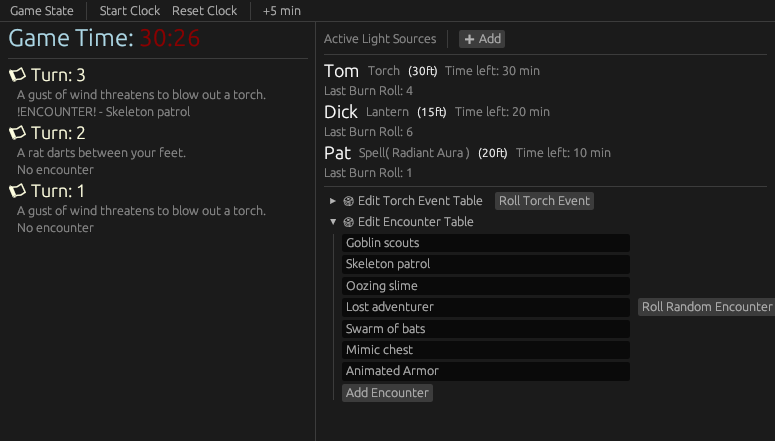

# 🕯️ Shadowtrack

**Shadowtrack** is a dungeon crawl utility app for game masters running torch-based exploration TTRPGs like **Shadowdark**, **Dungeon World**, or classic dungeon delves. It features a real-time clock, encounter triggers, dynamic light source management, and an in-game event log to help track the flow of tension and danger.

> Designed for use at the table or during online sessions to handle time-based narrative mechanics.

---


## 🎯 Key Features

- ⏱️ **In-World Time Tracking**  
  Simulates real-time exploration with minute-based progression and per-turn triggers every 10 minutes.

- 🔥 **Light Source Depletion**  
  Track individual torches, lanterns, or spells with adjustable durations and random sputtering risks.

- 👹 **Encounter System**  
  A 1-in-6 chance per 10-minute interval, rolled from a customizable encounter table.

- 📜 **Event Log**  
  Automatically records torch events, encounter outcomes, and major changes each turn.

- 💾 **Save and Load Game State**  
  Full serialization of exploration state using JSON — pause and resume at any time.

- 🧪 **Testable Core Systems**  
  Includes mockable random logic for deterministic testing of encounters and events.

---

## 🧰 Project Overview

```text
src/
├── main.rs           # Application entry point
├── app.rs            # Top-level eframe integration
├── app/
│   ├── state.rs      # Game state: turns, clock, light sources, logs
│   ├── systems.rs    # Torch depletion, encounters, and event rolls
│   ├── rng.rs        # Random number generator abstraction
│   ├── save/         # Save/load mechanics using serde
│   └── ui/           # Modular egui windows (lights, clock, log, etc.)
└── tests.rs          # Unit tests with deterministic mock RNG
```

---

## 🚀 Running the App

### Prerequisites

- [Rust (stable)](https://rust-lang.org)
- Linux, Windows, or macOS

### Launch

```bash
cargo run --release
```

---

## 💾 Save Format

The game state is saved as a JSON document. Example:

```json
{
  "turn": 4,
  "clock_elapsed": 60,
  "encounter_roll": 2,
  "light_sources": [
    {
      "label": "Torch A",
      "minutes_remaining": 20,
      "range": 30,
      "source_type": "Torch",
      "last_roll": 5
    }
  ],
  "encounter_table": ["Skeleton Patrol", "Slime Drip", "Whispering Wind"],
  "torch_event_table": ["A breeze threatens to extinguish a flame."],
  "event_log": [
    {
      "turn": 3,
      "encounter_result": "No encounter",
      "torch_event": "Flickering flame"
    }
  ],
  "new_light_type": "Torch",
  "new_light_label": "",
  "new_light_minutes": 60,
  "new_light_range": 30
}
```

---

## 🧪 Testing

This project includes unit tests that simulate the core event system deterministically:

```bash
cargo test
```

Tests cover:
- Torch burnout and double-failure rolls
- Encounter generation
- Torch events from custom tables
- RNG determinism via `MockRng`

---

## 🛣 Planned Improvements

- [ ] Editable log with tags (e.g., "combat", "travel", "mystery")
- [ ] Auto-save and session recovery
- [ ] Torch templates for faster entry
- [ ] Configurable dice logic per table (e.g., d6 vs d20)
- [ ] Export log as text summary

---

## 🧠 Inspirations

- **Shadowdark RPG** (real-time dungeon crawl model)
- Old-school hex/dungeon crawl timekeeping
- Tools like Donjon or Owlbear Rodeo for fast GM utilities

---

## 📄 License

This project is licensed under the [MIT License](LICENSE).

---

## 🙌 Contributing

Feel free to open issues, fork, or submit PRs for bugfixes, UX polish, or new features.
